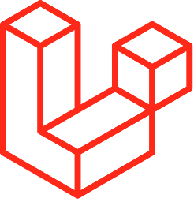
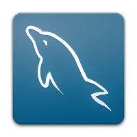
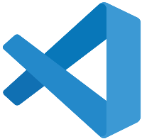
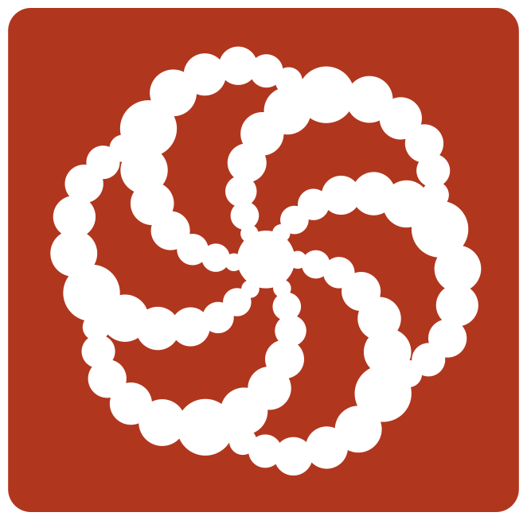

### About me

I've been learning to code since I was 13 in 2018. I started with trying to implement a complex calculator with Python but I didn't manage. Then my good friend advised me to start learning Frontend development. So did I. After some time there was a period when it all seemed to me very boring and uninteresting and suddenly I enjoyed coding with Python. I developed several Telegram bots, VK and YouTube parsers and integrated it to one project. But then I decided that it wasn't the very thing I'd like to work on. So I continued to study Frontend development. After I had learned HTML, CSS, Sass, JavaScript, client-server interaction, etc at a good level, I wanted to try myself as a Backend Developer. And here the fun begins! I really found a passion for Backend! Since 2020 I spend at least 5 hours a day developing in this direction. It's 2023 now and I'm am a Fullstack Developer, working as a freelancer&#128176;

* 🌍  I'm based in Russia, Vladimir
* 🖥️  See my portfolio at [no-link](https://)
* ✉️  You can contact me at [mihey0104@gmail.com](mailto:mihey0104@gmail.com)
* 🚀  I'm currently working on [organizer](http://github.com/muxalik/organizer)
* 🧠  I'm learning Laravel 10, React 

### Currently working with

    
    
    
    
    
    
    
    
    
    &nbsp;
    
    
    
    
    
    &nbsp;

### Previously worked with

    
    
    

### You can find me here

    &nbsp;&nbsp;
    &nbsp;&nbsp;
    

### My GitHub Stats
    

 
 

  

 
    
<h2>Top Repositories</h2>

    

        
        
        
    

### Support Me

